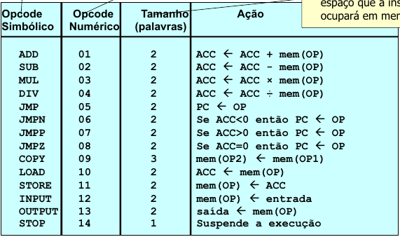

# Assembly Simulator

This is an assembly simulator for a made up assembly language. This machine has a memory with 216 16-bit words, a program counter register, PC and an accumulator register, ACC, both with 16 bits. There are three instruction types:

 1. Opcode
 2. Opcode Address
 3. Opcode Address Address

The supported operations are shown in the figure below:



## First Steps

This program depends on cmake, make and g++ to build. It uses C++11. Please install cmake, make and C++11 before proceeding.

### Compiling

To compile the project, follow the steps below.

First, run cmake to generate the makefiles:
```
cmake -B build
```

Then, go into the build dir, and run make (you may add `-j<cores>` to speed up compilation):
```
cd build && make
```

After that, the program is compiled and available in the src folder on the build dir.
```
cd src && ls simulador
```

You may copy it to the folder you would like to use and run it as following. The obj_file may be the absolute or relative path to the object file. It must have an .obj extension. The simulator will display the values of PC and ACC after each instruction and will generate a .out file with the results of the output instruction:
```
./simulador <obj_file>
```

## Running Unit Tests

The project was developed through an TDD approach, thus, it contains a thorough test suite, which is built with the executable. To run it, access the tests folder in the build directory and run the following command:

```
./simulador_tst
```

## Build tools

* [CMake](https://cmake.org/)
* [Make](https://www.gnu.org/software/make/)

## Contributing

This repository doesn't accept contributions until December 2021. If you must contribute, please reach out for the author.

## Authors

* **Mateus Berardo** - *Initial Work* - [MatTerra](https://github.com/MatTerra)

Also check out the [contributors](graphs/contributors).

## License

The author reserves all rights to the code hereby provided. It is strictly prohibited to copy or modify the code provided. It is allowed to use the code for educational purposes only and only if the author is credited. For any other use or more permissive conditions, contact the author. Any exceptions made by the author for third-parties does not mean changes in this license's terms for other people.

## Acknoledgements

* **Billie Thompson** - *README template* - [PurpleBooth](https://github.com/PurpleBooth)

